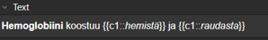

# Periaatteet 

Jokaisella on oma tyylinsä tehdä kortteja eikä yksi ole toista parempi yksiselitteisesti. Jokainen löytää itselleen parhaiten sopivimman workflown vain kokeilemalla. Esittelen myöhemmin oman workflowni, mutta tässä alla nopeasti muutamia periaatteita, joita kannattaa seurata. 

## Periaate 0: Ajattele muita 

Ajattele, että teet kortteja jollekin toiselle henkilölle, joka ei pysty lukemaan ajatuksiasi. Kun seuraa tätä ajatusmallia, niin pääsee hyvin pitkälle. Tämä erityisesti pakottaa siihen, että on annettava kontekstia korteille, eikä voi vain tehtailla kortteja, ilman että lisäisi selityksiä extra-fieldiin tai avaisi asiaa jonkin toisen kentän kautta. Ei voi myöskään sanoittaa kysymyksiä liian avoimesti tai epäselvästi samalla tavalla kuin vain omille silmille tarkoitetuissa korteissa, koska toiset ihmiset eivät voi tietää, millaista vastausta juuri sinä haet korttiin tässä kohtaa. 

## Periaate 1: Perusteet kuntoon 

Perusasioistakin on hyvä tehdä kortteja - ei kannata ajatella niiden aina olevan turhia. Korttien läpikäyjät voi niitä myöhemmin sitten hyllyttää, kun kokevat ne tarpeettomiksi. 

Esimerkki: 

- On todennäköisesti selvää kaikille, että hemoglobiini koostuu hemistä ja globiinista, mutta tästäkin on hyvä olla kortti, koska se lisää ymmärrystä siitä, että on kaksi hemoglobiinin tuotantoon vaikuttavaa rakennusosaa ja jos niistä on puutetta, myös hemoglobiinista on puutetta. 

## Periaate 2: Pilko pienemmäksi {#Periaate2}

Yhden kortin ei tulisi olla liian laaja. Ei esimerkiksi kannata kysyä avointa kysymystä, johon oikea vastaus olisi moniosainen pieni essee. Näiden korttien läpikäyminen on raskasta ja niitä läpikäydessä on vaikeaa arvioida, osasiko kortin oikeasti (voisiko esim. merkata kortin oikein vastatuksi, vaikka ei muistanutkaan yhtä tärkeää osaa vastauksesta, mutta muisti suurimman osan). 

- Välillä sääntöä on osittain pakko rikkoa, kun esim. tekee kortteja, joissa pitää listata tietyn sairauden mahdollisia oireita tai tiettyjä sairauksia, jotka voivat olla tietyn oireen taustalla yms. 
  - Näiden korttien yksiselitteisyyttä läpikäyjälle lisää mm. muistisäännöt, joiden pohjalta pitää muistaa kysytty lista. 
  - Jos ei ole mielekästä etsiä muistisääntöä listalle, niin voi esim. merkata clozejen perään (yleisin) ja (toiseksi yleisin) ja tätä kautta kohdistaa läpikäyjän muistia vain tiettyihin listan osiin eikä kaikkiin mahdollisuuksiin. 
  
Esim. ei näin (vanha oma VHN-korttini). Kysymyksenasettelu on aivan liian laaja (Kysymyksenä "Glomerulusfiltraatio: anatomia, toimintaperiaate, vaikuttavat voimat ja sairaudet"). Tästä voisi mieluummin tehdä monta kymmentä pienempää korttia ja tehdä korttien alle tiivistelmän aiheesta, joka kulkee extra-kentässä mukana. 

## Periaate 3: Kokonaisuus

Pienet kortit testaavat tarkkaa informaatiota, mutta välillä kokonaisuus voi alkaa lipsumaan muistista. Tämän takia kannattaa usein lisätä kortin extra-kenttään (tai muihin mahdollisiin kenttiin) tarkempi selitys, kuva, taulukko, tiivistelmä yms. aiheesta. Kannattaa aina myös viitata liittyviin aiheisiin, erityisesti jos tietyt asiat ovat suhteellisen samankaltaisia, mutta niiden välillä on tiettyjä eroja. 

## Periaate 4: Toistaminen 

Ei ole väärin kysyä samaa asiaa kahdesti! Samasta aiheesta kannattaa usein tehdä useita eri kortteja. Hyökkää korteissa aiheeseen kuitenkin eri näkökulmista -> tieto informaatiosta ei jää niin pinnalliseksi. 

## Periaate 5: Kuvat 

Kuvia kannattaa käyttää tilanteessa kuin tilanteessa extra-kentässä tai muissa kentissä. Kuvat selkeyttävät kortteja ja tekevät muistamisesta helpompaa. 